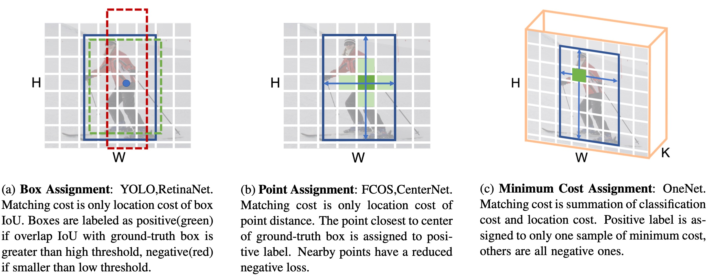

## OneNet: End-to-End One-Stage Object Detection by Classification Cost

[](https://opensource.org/licenses/MIT)



## Paper
[OneNet: End-to-End One-Stage Object Detection by Classification Cost](https://peizesun.github.io/OneNet.pdf)

## Comming
  - [ ] Provide models and logs
  - [ ] Support to caffe, onnx, tensorRT
  - [ ] Support to Res18, MobileNet
  
## Models
We provide two models 
- R50_dcn is for high accuracy
- R50_nodcn is for easy deployment.

Method | inf_time | train_time | box AP | download
--- |:---:|:---:|:---:|:---:
[R50_dcn](projects/OneNet/configs/onenet.res50.dcn.yaml)     | 67 FPS | 36h  | 35.0 | 
[R50_nodcn](projects/OneNet/configs/onenet.res50.nodcn.yaml) | 73 FPS | 29h  | 32.7 | 


#### Notes
- We observe about 0.3 AP noise.
- The training time and inference time are on 8 NVIDIA V100 GPUs.


## Installation
The codebases are built on top of [Detectron2](https://github.com/facebookresearch/detectron2) and [DETR](https://github.com/facebookresearch/detr).

#### Requirements
- Linux or macOS with Python ≥ 3.6
- PyTorch ≥ 1.5 and [torchvision](https://github.com/pytorch/vision/) that matches the PyTorch installation.
  You can install them together at [pytorch.org](https://pytorch.org) to make sure of this
- OpenCV is optional and needed by demo and visualization

#### Steps
1. Install and build libs
```
git clone https://github.com/PeizeSun/OneNet.git
cd OneNet
python setup.py build develop
```

2. Link coco dataset path to OneNet/datasets/coco
```
mkdir -p datasets/coco
ln -s /path_to_coco_dataset/annotations datasets/coco/annotations
ln -s /path_to_coco_dataset/train2017 datasets/coco/train2017
ln -s /path_to_coco_dataset/val2017 datasets/coco/val2017
```

3. Train OneNet
```
python projects/OneNet/train_net.py --num-gpus 8 \
    --config-file projects/OneNet/configs/onenet.res50.dcn.yaml
```

4. Evaluate OneNet
```
python projects/OneNet/train_net.py --num-gpus 8 \
    --config-file projects/OneNet/configs/onenet.res50.dcn.yaml \
    --eval-only MODEL.WEIGHTS path/to/model.pth
```

5. Visualize OneNet
```    
python demo/demo.py\
    --config-file projects/OneNet/configs/onenet.res50.dcn.yaml \
    --input path/to/images --output path/to/save_images --confidence-threshold 0.4 \
    --opts MODEL.WEIGHTS path/to/model.pth
```

## License

OneNet is released under MIT License.


## Citing

If you use OneNet in your research or wish to refer to the baseline results published here, please use the following BibTeX entries:

```BibTeX

@article{peize2020onenet,
  title   =  {{OneNet}: End-to-End One-Stage Object Detection},
  author  =  {Peize Sun and Yi Jiang and Zehuan Yuan and Changhu Wang and Ping Luo},
  journal =  {arXiv preprint arXiv: },
  year    =  {2020}
}

```
